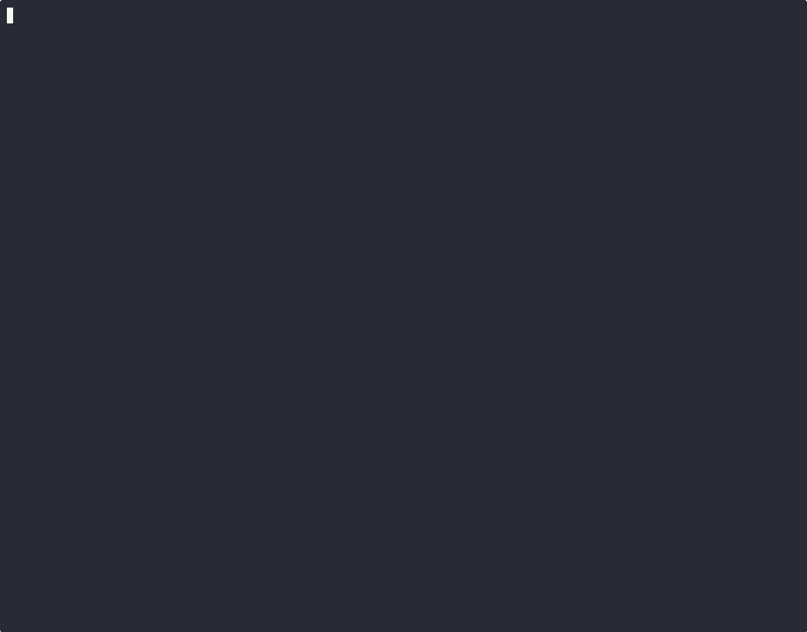

# Agent Sandbox + Kata Containers Demo

A scripted terminal demo showing the value of [agent-sandbox](https://github.com/kubernetes-sigs/agent-sandbox) with Kata Containers for VM-isolated AI agent workloads.



## What's covered

1. **The Problem** -- managing AI agent environments with plain Pods (manual, no isolation)
2. **Agent Sandbox + Kata** -- single Sandbox CRD with VM-level isolation, lifecycle management, scale-to-zero
3. **Warm Pool Pattern** -- pre-warmed Kata VM pods for instant sandbox provisioning via SandboxClaim
4. **Summary** -- value comparison table

## Prerequisites

- Kubernetes/OpenShift cluster with [agent-sandbox](https://github.com/kubernetes-sigs/agent-sandbox) installed
- Kata Containers runtime (`kata` RuntimeClass)
- `kubectl` or `oc` CLI access
- `pv` (`brew install pv`) -- for typing simulation
- `asciinema` -- for recording
- `agg` (`brew install agg`) -- for GIF conversion (optional)

## Running the demo

```bash
# Record
asciinema rec demo.cast --cols 120 --rows 40
./demo.sh
# Ctrl+D to stop

# Convert to GIF
agg demo.cast demo.gif
```

## Tuning

| Variable | Default | Purpose |
|----------|---------|---------|
| `TYPE_SPEED` | 25 | Typing speed (chars/sec) |
| `NARRATE_PAUSE` | 3 | Pause after narration (seconds) |
| `CMD_PAUSE` | 2 | Pause after command output (seconds) |
| `INTERACTIVE` | 0 | Set to 1 to pause between sections |
| `SKIP_CLEANUP` | 0 | Set to 1 to skip initial cleanup |
| `KUBECTL` | kubectl | Use `oc` instead if needed |
