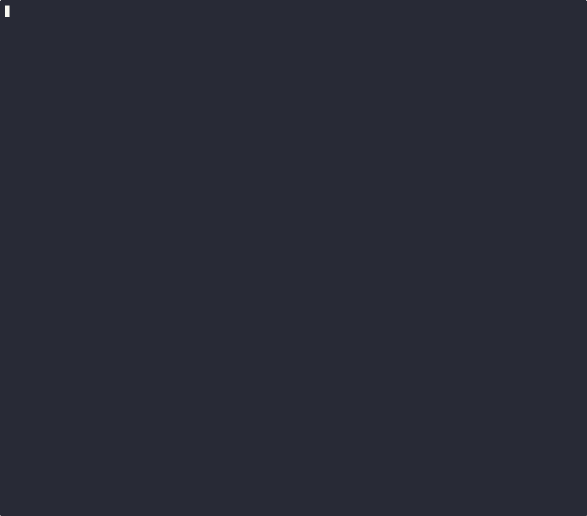

# Security Scenario: When AI Generates Dangerous Code

An AI code interpreter is asked to analyze system performance. The LLM generates a legitimate Python script -- but it also reveals sensitive infrastructure details. We run the same code in a plain Pod (runc) vs an Agent Sandbox (Kata) to compare the blast radius.



## What the AI-generated code discovers

| What the code sees | Plain Pod (runc) | Agent Sandbox (Kata) |
|---|---|---|
| Hardware identity | Dell PowerEdge R760 | KVM (generic VM) |
| Kernel version | Host kernel (5.14) | VM kernel (6.12) |
| CPU cores visible | 128 (all host CPUs) | 1 (VM only) |
| Memory visible | ~1 TB (all host RAM) | ~1.8 GB (VM only) |
| Kernel symbols | Host symbols (exploitable) | VM symbols (useless) |
| Mount points | 157 (host disk visible) | 24 (VM only) |

## Running

```bash
asciinema rec security-demo.cast --cols 120 --rows 45
./security-demo.sh
# Ctrl+D to stop
agg security-demo.cast security-demo.gif
```

## Prerequisites

Same as the [main demo](../../README.md) -- a cluster with agent-sandbox and Kata RuntimeClass installed.
